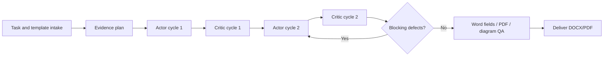

<p align="center">
  
</p>

<h1 align="center">DOCX Course Report Writer</h1>

<p align="center">
  A Codex Skill for Chinese coursework reports, lab reports, course papers, and LaTeX-to-Word delivery.
  <br>
  It turns report writing into a planned, evidence-first, reviewed, and verifiable DOCX/PDF workflow.
</p>

<p align="center">
  Language:
  <a href="README.md">简体中文</a> |
  <strong>English</strong>
</p>

<p align="center">
  <a href="#quick-start"></a>
  <a href="#quality-gates"></a>
  <a href="#superpowers-workflow"></a>
  <a href="#diagram-qa"></a>
  <a href="LICENSE"></a>
</p>

---

## What It Does

`docx-course-report-writer` is a local Codex Skill for producing and repairing Chinese academic DOCX reports. It starts with task intake and evidence planning, generates or repairs the Word document, then verifies fields, table of contents, diagrams, layout, and factual consistency before delivery.

Use it for:

- Chinese course reports, lab reports, course papers, reading reports, and literature reviews.
- Reports that depend on real code output, logs, screenshots, figures, citations, or data tables.
- Word reports that must follow a user-provided template or the integrated default template.
- LaTeX/TikZ diagrams, flowcharts, architecture diagrams, screenshots, and data plots inside DOCX.
- Repairing existing DOCX files with stale content, broken TOCs, outdated fields, poor diagrams, or PDF export issues.

## Contents

- [Why Use It](#why)
- [Demo](#demo)
- [Features](#features)
- [Quick Start](#quick-start)
- [Workflow](#workflow)
- [Superpowers Workflow](#superpowers-workflow)
- [Actor/Critic Iteration](#actor-critic)
- [WSL And Screenshot Highlights](#wsl-screenshot)
- [Diagram QA](#diagram-qa)
- [Default Template](#default-template)
- [Quality Gates](#quality-gates)
- [Project Structure](#project-structure)
- [Examples](#examples)
- [FAQ](#faq)

<a id="why"></a>

## Why Use It

Many generated reports fail in ways that are easy to miss:

| Common failure | How this Skill handles it |
| --- | --- |
| The report looks complete but lacks real evidence | Builds a requirement-to-evidence checklist and fact ledger |
| Word TOC, page numbers, or fields are not actually updated | Uses real Word heading styles and prefers Word COM on Windows |
| Old template content leaks into the new report | Runs template residue checks and clears stale body content |
| References look complete but contain weak or unverifiable metadata | Locks a reference metadata ledger before drafting; uses sequential numeric references by default and strictly follows GB/T 7714-2015 after DOI or authoritative-source verification |
| Flowchart or TikZ arrows overlap text or modules | Requires a final Review And Revise pass for every diagram |

The goal is not only to create a file that opens. The goal is to produce a report package that is closer to submission quality.

<a id="demo"></a>

## Demo: Deep Learning Architecture Course Report

This demo comes from a complete report run with two Actor/Critic review cycles. It shows the details this Skill treats as delivery gates: a one-page cover, right-aligned TOC page numbers, formal figure numbering, references that strictly follow GB/T 7714-2015 by default, no raw source or production-process lines in the body, and page-level PDF rendering for every final page.

| File | Description |
| --- | --- |
| [`deep-learning-architecture-report-demo.docx`](docs/deep-learning-architecture-report-demo.docx) | Current Word demo output |
| [`deep-learning-architecture-report-demo.pdf`](docs/deep-learning-architecture-report-demo.pdf) | Current Word COM exported PDF |
| [`deep-learning-report-page-01.png`](docs/deep-learning-report-page-01.png) - [`deep-learning-report-page-11.png`](docs/deep-learning-report-page-11.png) | Current report page-by-page PDF renders |

<table>
  <tr>
    <td width="50%"></td>
    <td width="50%"></td>
  </tr>
  <tr>
    <td width="50%"></td>
    <td width="50%"></td>
  </tr>
  <tr>
    <td width="50%"></td>
    <td width="50%"></td>
  </tr>
  <tr>
    <td width="50%"></td>
    <td width="50%"></td>
  </tr>
  <tr>
    <td width="50%"></td>
    <td width="50%"></td>
  </tr>
  <tr>
    <td width="50%"></td>
    <td width="50%"></td>
  </tr>
</table>

The deterministic figure showcase now uses the current report's architecture trade-off map:

<p align="center">
  
</p>

<a id="features"></a>

## Features

| Feature | Description |
| --- | --- |
| Chinese DOCX report generation | Supports common coursework, lab, paper, and review structures |
| Template-first assembly | Uses the user template when provided, otherwise uses the integrated default template |
| Word TOC and field update | Uses real heading styles and automatic Word fields |
| PDF and page-level QA | Exports from Word first, renders final PDF pages to PNG, and uses four-page contact sheets for review |
| Evidence-first writing | Tracks logs, screenshots, data, scores, filenames, model names, and dates |
| GB/T 7714-2015 references | Uses sequential numeric citations and strictly follows GB/T 7714-2015 by default for course-report references |
| Linux/WSL runtime | Checks whether the host is Linux; otherwise verifies WSL on Windows; asks before installing WSL when missing |
| Browser and terminal screenshots | Treats screenshots as first-class evidence, including browser pages, terminal windows, GUI states, and external source pages |
| Diagram and TikZ review | Audits arrows, labels, spacing, semantics, and final scaling |
| Controlled AI images | Always asks whether text-to-image is enabled and the exact maximum number of images that may be generated or inserted |
| Actor/Critic loop | Creates Actor and Critic roles, runs at least two full iterations, and continues while blockers remain |

<a id="quick-start"></a>

## Quick Start

Install this project into your Codex skills directory:

```powershell
C:\Users\<User>\.codex\skills\docx-course-report-writer
```

Then invoke it directly in Codex:

```text
Use $docx-course-report-writer to create a Chinese lab report from requirements.md and src/.
Run the code, capture real evidence, and deliver DOCX plus PDF.
Ask me before enabling text-to-image figures and confirm the maximum image count.
```

Recommended inputs:

- Assignment requirements or grading rubric.
- User-provided DOCX template, if any.
- Code, logs, screenshots, data tables, references, or an existing draft.
- Cover metadata such as name, student ID, course name, teacher, and date.
- Whether PDF, proof screenshots, charts, appendix, or citations are required.
- If citations are required, expect sequential numeric references that strictly follow GB/T 7714-2015 unless the assignment or template explicitly requires another standard.

<a id="workflow"></a>

## Workflow



See [`references/workflow.md`](references/workflow.md) for the full workflow.

<a id="superpowers-workflow"></a>

## Superpowers Workflow

When the Superpowers plugin or any `superpowers:*` skills are installed, this Skill must invoke the relevant Superpowers workflow before acting:

- Use Superpowers at task start.
- Use planning workflows when scope or execution order matters.
- Use execution, debugging, or subagent workflows for implementation and repair.
- Use verification-before-completion or an equivalent final gate before delivery.

If Superpowers is unavailable, use [`references/superpowers-adapter.md`](references/superpowers-adapter.md) as the local fallback and record that limitation.

<a id="actor-critic"></a>

## Actor/Critic Iteration

Every run creates two roles:

| Role | Responsibility |
| --- | --- |
| Actor | Builds, repairs, regenerates, draws, exports, and integrates the report |
| Critic | Independently audits the actual artifact and blocks delivery while defects remain |

Rules:

- Run at least two full `Actor -> Critic` cycles.
- There is no maximum iteration count.
- The Critic audits the current DOCX/PDF/diagram/log artifacts, not just the plan.

See [`references/actor-critic-loop.md`](references/actor-critic-loop.md).

<a id="wsl-screenshot"></a>

## WSL And Screenshot Highlights

### Skilled Linux/WSL Runtime Handling

When a coursework task needs Linux/POSIX behavior, this Skill follows a fixed runtime route:

1. Check whether the host is already Linux.
2. If not, check for a local Linux runtime. On Windows, prefer WSL.
3. If WSL is available, record the distribution, kernel, compiler/runtime versions, Windows-to-WSL path mapping, and real build/run/test commands.
4. If WSL is missing, ask whether the user allows WSL installation or enablement. It does not install WSL without explicit permission.
5. If setup needs admin rights, network access, Store login, or reboot, record the limitation and use results only after the Linux environment is verified.

This is useful for Linux coursework, C/POSIX labs, sockets, processes, signals, shared memory, semaphores, Makefiles, and Linux-only commands.

### Screenshots As Verifiable Evidence

Screenshots are treated as evidence assets, not decoration. The Skill plans screenshot targets during intake:

- Browser screenshots: verify the intended page and reject 403, login, CAPTCHA, blank, error, or wrong-tab captures.
- Terminal screenshots: prefer real visible terminal captures with command, working directory, key output, and verification result.
- GUI/app screenshots: capture the window region that proves the relevant state.
- Raw and annotated separation: save raw screenshots first, then make cropped or red-box annotated copies.
- Final insertion review: check readability after DOCX/PDF scaling and ensure annotations do not hide proof text.

See [`references/tooling-recipes.md`](references/tooling-recipes.md).

<a id="diagram-qa"></a>

## Diagram QA

Every self-drawn figure, TikZ drawing, flowchart, architecture diagram, mechanism diagram, timeline, or similar visual must enter a final `Review And Revise` stage after rendering.

Required checks:

- No arrow is crossed, hidden, clipped, ambiguous, or pointed at the wrong target.
- No arrow overlaps text, modules, legends, titles, numbering, or captions.
- Labels do not overflow boxes or collide with borders and other labels.
- The final DOCX/PDF-scaled image remains readable, clean, and semantically correct.
- AI-generated images never replace real experimental results, screenshots, or data plots.
- Report-visible figures, captions, paragraphs, and tables do not contain production-process claims about how a figure was made, generated, rendered, or checked. Keep those details in the run record or attribution sidecar.

See [`references/figures-and-diagrams.md`](references/figures-and-diagrams.md).

<a id="default-template"></a>

## Default Template

Template precedence is fixed:

1. Use the user-provided DOCX template when available.
2. Otherwise use [`skill-assets/default-course-report-template.docx`](skill-assets/default-course-report-template.docx).

### User-Template Fidelity

When the user provides a DOCX template, the skill must treat that file as the layout source of truth rather than loose writing inspiration.

Recommended workflow:

1. Copy the user template to the target output path first.
2. Inspect the copied template structure before writing: cover tables, section breaks, margins, styles, TOC position, placeholders, sample body, headers, footers, and media.
3. Replace known placeholders and cover metadata in place.
4. Insert new report content into the copied template without rebuilding page setup or styles from scratch.
5. Remove only stale sample body, stale TOC entries, irrelevant old screenshots, and placeholder paragraphs that are proven to belong to template sample content.
6. Run template-fidelity QA comparing the final DOCX against the source template.

`scripts/build_report.py --template ...` defaults to this copy-first, write-in-place behavior. Destructive body replacement is opt-in through `--drop-template-body`; it must not be used for a user-specified template unless the user explicitly asks for it.

The default builder preserves useful page setup, heading styles, table styling, cover style, and metadata while clearing stale body content, old screenshots, old TOC entries, and unrelated media. After the cover and TOC, it starts the body in a new Word section with page numbering restarted at 1.

<a id="quality-gates"></a>

## Quality Gates

Before delivery, the run must pass or explicitly document limitations for:

- Evidence authenticity.
- Template residue.
- Linux/WSL runtime verification when Linux/POSIX behavior matters.
- Word TOC, page numbers, references, and fields.
- Cover and TOC layout: the default cover occupies page 1 only, TOC page numbers are right-aligned with formal dot leaders, and cover/TOC pages do not count as body pages or display the body `PAGE` field; the first visible page number 1 must be on the first chapter/body page.
- References: metadata is verified before drafting; in-text citations are superscript numeric references; the final bibliography strictly follows GB/T 7714-2015 by default; if a course requires another standard, the run record must say so explicitly.
- Fact consistency across text, captions, tables, and figures.
- Screenshot authenticity for browser and terminal captures.
- Diagram semantics, arrows, labels, and layout.
- Figure captions: every image has a formal `Figure x.x Title` style caption in the target language, and raw provenance/source lines do not leak into the report body.
- Rendered PDF/page inspection when layout matters. Prefer Word COM field update and PDF export first, then `scripts/render_pdf_review_pages.py` to create page PNGs and four-page review sheets. Treat `BLANK_PAGE` output as blocking unless the blank page is intentional and documented.
- Analysis depth for experiment-heavy reports.

See [`references/report-qa-checklist.md`](references/report-qa-checklist.md).

<a id="project-structure"></a>

## Project Structure

```text
docx-course-report-writer/
├─ SKILL.md
├─ README.md
├─ README.en.md
├─ assets/
│  └─ logo.png
├─ skill-assets/
│  ├─ default-course-report-template.docx
│  ├─ report-draft-template.md
│  ├─ references-template.md
│  └─ image-attributions-template.md
├─ references/
│  ├─ workflow.md
│  ├─ actor-critic-loop.md
│  ├─ figures-and-diagrams.md
│  ├─ report-qa-checklist.md
│  └─ ...
├─ scripts/
│  ├─ build_report.py
│  ├─ qa_docx_report.py
│  ├─ render_pdf_review_pages.py
│  ├─ update_word_fields.ps1
│  └─ annotate_screenshot.py
└─ docs/
   ├─ deep-learning-architecture-report-demo.docx
   ├─ deep-learning-architecture-report-demo.pdf
   ├─ deep-learning-report-page-01.png
   ├─ ...
   ├─ deep-learning-report-page-11.png
   ├─ deep-learning-architecture-tradeoff-map.png
   └─ testing-report.md
```

<a id="examples"></a>

## Examples

- Sample DOCX: [`docs/sample-report.docx`](docs/sample-report.docx)
- Sample PDF: [`docs/sample-report.pdf`](docs/sample-report.pdf)
- Testing notes: [`docs/testing-report.md`](docs/testing-report.md)
- Historical failures and fixes: [`docs/historical-failures.md`](docs/historical-failures.md)

<a id="faq"></a>

## FAQ

### What if no template is provided?

The Skill uses [`skill-assets/default-course-report-template.docx`](skill-assets/default-course-report-template.docx). A user-provided template always takes priority.

### Can it insert AI-generated images?

Yes, but it must first ask whether text-to-image is enabled and the exact maximum number of images that may be generated or inserted. AI images are only for explanatory or conceptual use.

### Why require at least two Actor/Critic cycles?

Most DOCX report failures happen after the first draft: stale template content, broken TOC fields, weak evidence, bad layout, or unreadable diagrams. Two mandatory cycles make artifact review part of the workflow.

### Why emphasize arrows?

Flowcharts and TikZ diagrams often fail because arrows cross, overlap text, or become unclear after scaling into Word. This Skill treats arrow review as a required quality gate.

## Design References

The README layout, language entry, and quick navigation are inspired by [`luongnv89/claude-howto`](https://github.com/luongnv89/claude-howto). The planning, execution, debugging, and verification workflow is aligned with [`obra/superpowers`](https://github.com/obra/superpowers).
