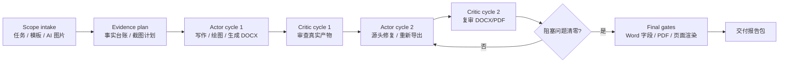

<p align="center">
  
</p>

<h1 align="center">DOCX Course Report Writer</h1>

<p align="center">
  <em>“没有什么比一件未完成的任务一直挂在那里更令人疲惫。”</em>
  <br>
  <sub>William James，1886。每个被课程报告追杀的大学生都懂。</sub>
</p>

<p align="center">
  面向大学生水课课程报告、实验报告、课程论文与综述写作的 Codex Skill。
  <br>
  这是一个被本学期过量课程报告逼出来的自动化工作流。
  <br>
  把“又要写 Word 报告”变成“可规划、可验证、可修复、可提交”的文档工程流程。
</p>

<p align="center">
  <a href="#quick-start"></a>
  <a href="#demo"></a>
  <a href="#demo"></a>
  <a href="#highlights"></a>
  <a href="#workflow"></a>
  <a href="README.en.md"></a>
</p>

<p align="center">
  
  
</p>

---

## 它解决什么问题？

大学水课很多，课程报告也很多。真正消耗人的不是某一篇报告，而是一学期里反复出现的“查资料、凑结构、配图、写格式、调目录、导 PDF、再返工”。这个 Skill 就是为这种场景做的：让重复性课程报告尽量自动化，让 Codex 不只是写正文，而是把 Word 交付链路一起跑完。

很多课程报告不是“写不出来”，而是交付前容易在这些地方翻车：

| 报告问题 | Skill 的处理方式 |
| --- | --- |
| 内容看似完整，但没有证据链 | 先建立事实台账，再写结论；运行日志、截图、引用和数据必须可追踪 |
| Word 目录、页码、字段没更新 | 使用真实 Word 标题样式，Windows 下优先 Word COM 更新字段并导出 PDF |
| 封面、模板、旧内容残留 | 使用模板优先策略，并检查占位符、旧主题、旧截图和乱码 |
| 参考文献看似完整但信息不准 | 写作前建立引用元数据台账；默认使用并严格遵循 GB/T 7714-2015 顺序编码制，完成 DOI/权威来源核验后再排版 |
| 图表插进去后不专业 | 强制正式图注、图号顺序、箭头/文字布局审查和 PDF 页面级 QA |
| AI 图片被误当证据 | AI 图只作概念解释；来源、prompt 和非证据属性写入旁路记录 |

`docx-course-report-writer` 的目标不是生成一份“能打开”的 DOCX，而是生成一份能经得住课程提交、教师检查和二次修订的报告包。它适合那些要求不一定难、但格式和交付细节非常烦的课程报告。

<a id="demo"></a>

## 示例展示：深度学习架构课程报告

下面的示例来自一次完整生成并经过两轮 Actor/Critic 审查的课程报告。它展示了这个 Skill 现在会强制关注的细节：封面只占第一页、目录页码右对齐、图注使用 `图x.x` 正式编号，参考文献默认并严格遵循 GB/T 7714-2015，正文不泄漏原始制图来源或工艺说明，最终 PDF 每一页都经过页面级渲染检查。

| 文件 | 说明 |
| --- | --- |
| [`deep-learning-architecture-report-demo.docx`](docs/deep-learning-architecture-report-demo.docx) | 已上传到 GitHub 的修订版 Word 示例产出 |
| [`deep-learning-architecture-report-demo.pdf`](docs/deep-learning-architecture-report-demo.pdf) | 已上传到 GitHub 的 Word COM 导出 PDF 示例产出 |
| [`deep-learning-report-page-01.png`](docs/deep-learning-report-page-01.png) - [`deep-learning-report-page-11.png`](docs/deep-learning-report-page-11.png) | 当前报告逐页 PDF 渲染预览 |

### 当前报告逐页预览

<table>
  <tr>
    <td width="50%"></td>
    <td width="50%"></td>
  </tr>
  <tr>
    <td width="50%"></td>
    <td width="50%"></td>
  </tr>
  <tr>
    <td width="50%"></td>
    <td width="50%"></td>
  </tr>
  <tr>
    <td width="50%"></td>
    <td width="50%"></td>
  </tr>
  <tr>
    <td width="50%"></td>
    <td width="50%"></td>
  </tr>
  <tr>
    <td width="50%"></td>
    <td width="50%"></td>
  </tr>
</table>

### AI 架构图：一次文生图合格示例

2026-06-11 的实践暴露了一个关键问题：只写“深度学习、神经网络、科技感、未来感、发光线条”会生成很多视觉资产，但观众很难判断图到底在讲 CNN、Transformer、训练流程还是部署系统。Skill 现在要求先设计信息架构，再设计视觉风格。

对于架构图、示意图、流程图、pipeline 图和模型结构图，最终 AI 生成图必须一次性直接包含可读文字、具名模块、方向箭头、图例和分层关系。不允许先生成无字底图，再用 Pillow/SVG/TikZ/PowerPoint 或其他工具补字、补箭头、补图例。如果文生图的文字、箭头或图例不合格，只能重新文生图绘制，或改用单独的非 AI 确定性图。

<p align="center">
  
</p>

这张图是一次文生图直接生成的验收样例：它解释 `Self-Attention` 加权求和知识点，包含 `Input Tokens`、`Q Query`、`K Key`、`V Value`、`Scores QK^T`、`Softmax`、`Weighted Sum`、`Output Tokens` 等具名模块，并用箭头和图例表达方向关系与颜色语义。

### 新绘图策略：知识结构驱动，而不是科技海报

2026-06-12 的深度学习课程报告实践进一步暴露了文生图 prompt 的根本问题：主题驱动 prompt 会自动滑向“神经网络节点、蓝色发光线路、服务器、芯片、数据流、透明模块”的 AI 视觉模板，画面复杂但信息空心。现在 Skill 将文生图 prompt 重构为知识结构驱动：先定义一张图只回答的一个核心问题，再列出必须出现的知识模块、方向关系、标签、图例和禁止装饰。

下面是新策略生成的训练流程教学信息图。它不是“关于深度学习的高级科技图”，而是明确解释训练数据、预处理、神经网络、前向传播、预测与标签、损失函数、反向传播、优化器更新、训练循环和推理输出之间的关系。

<p align="center">
  
</p>

对于确定性图，Skill 现在要求先判断图的任务：流程、时间线、模型架构和模块关系图应优先选择可控、可复现、可审查的绘图方式；真实数据图表、热力图、图像拼接和数值驱动可视化则优先使用数据绘图工具。无论采用哪种方式，最终报告中只保留帮助读者理解内容的图形、标签和正式图注，不在正文或图中写入制图过程、编码方式、渲染工具等工艺说明。

<p align="center">
  
</p>

这两张图的验收重点不同：文生图示例检查“是否摆脱空泛科技海报、是否具备知识模块和语义密度”；确定性图示例检查“位置关系是否解释架构取舍、标签是否清晰、缩放后是否仍然可读”。

<a id="highlights"></a>

## 亮点

### 1. Source-first，不凭空写结果

报告先做 evidence plan：任务要求、运行命令、日志、截图、数据、文件名、模型名、引用来源和最终结论都进入事实台账。没有真实证据的结论会被标成限制或推断。

### 2. Word-first，避免“看起来像目录”的假目录

生成器使用真实 Word 标题样式和自动目录字段；Windows 下通过 Word COM 更新目录、页码、字段并导出 PDF。目录页码右对齐、参考文献分页、封面单页都作为验收条件。

### 3. Actor/Critic 双角色审查

每次运行至少两轮：

```text
Actor 生成 / 修复 -> Critic 审查真实 DOCX/PDF/图片 -> Actor 再修复 -> Critic 复审
```

Critic 审查的不是计划，而是实际产物。只要封面、目录、图表、字段、事实或渲染仍有阻塞问题，就继续迭代。

### 4. 图表不是装饰，是可读性工程

流程图、架构图、时间线、TikZ 图、自绘图和 AI 概念图都要经过 Review And Revise。重点检查箭头、文字压框、图号、图注、缩放后的清晰度，以及是否误把概念图写成证据。

### 5. 对中文课程项目友好

默认中文报告结构、中文封面、中文图注、中文 QA 规则，并且针对 Windows、中文路径、Word COM、WSL、截图和 PDF 渲染等高频课程交付问题做了专门处理。

<a id="quick-start"></a>

## 快速开始

### 先安装 Superpowers 插件（推荐）

建议在使用本 Skill 前，先安装并启用 [Superpowers](https://github.com/obra/superpowers) 插件。`docx-course-report-writer` 的执行约束默认会优先调用 Superpowers 的规划、调试、测试和完成前验证流程；安装后更容易稳定执行 Actor/Critic 审查、文档质量门禁和复杂报告修复。

如果当前环境没有 Superpowers，本 Skill 仍可运行，但会退回到 [`references/superpowers-adapter.md`](references/superpowers-adapter.md) 中的本地等价流程，并在运行记录中说明该限制。

### 安装

将仓库放入 Codex skills 目录：

```powershell
C:\Users\<用户名>\.codex\skills\docx-course-report-writer
```

在 Codex 中点名使用：

```text
请使用 $docx-course-report-writer，根据 assignment.md、template.docx 和 src/ 生成中文实验报告。
需要真实运行、截图、导出 DOCX 和 PDF。
```

### 推荐输入

| 输入 | 为什么需要 |
| --- | --- |
| 课程要求 / rubric | 锁定评分点和报告结构 |
| DOCX 模板 | 保留学校或课程格式；未提供时使用内置默认模板 |
| 代码、日志、截图、数据 | 形成证据链，避免编造实验结果 |
| 参考文献或论文链接 | 支撑综述、课程论文和技术事实；默认采用并严格遵循 GB/T 7714-2015 |
| 姓名、学号、课程名、教师名 | 生成正式封面 |
| 是否允许 AI 图片及数量 | AI 图像是阻塞式 intake 问题，不能静默默认 |

<a id="workflow"></a>

## 工作流



完整流程见 [`references/workflow.md`](references/workflow.md)。

## 默认模板与生成器

模板优先级：

1. 用户提供的 DOCX 模板。
2. 内置默认模板：[`skill-assets/default-course-report-template.docx`](skill-assets/default-course-report-template.docx)。
3. 只有用户明确要求空白文档时，才使用无模板文档。

### 用户模板保真

当用户提供 DOCX 模板时，Skill 必须把该模板视为版式事实来源，而不是只参考写作思路。

推荐流程：

1. 先复制用户模板到目标输出路径。
2. 写入前检查复制后的模板结构：封面表格、分节符、页边距、样式、目录位置、占位符、示例正文、页眉页脚和媒体。
3. 原位替换已知占位符和封面元数据。
4. 在复制模板中插入新报告内容，不重新创建页面设置或样式体系。
5. 只删除已确认属于模板示例内容的旧正文、旧目录项、无关旧截图和占位段落。
6. 用模板保真 QA 对比最终 DOCX 与源模板。

`scripts/build_report.py --template ...` 默认采用上述复制模板并原位写入的策略。破坏性清空模板正文只允许通过 `--drop-template-body` 显式开启；用户指定模板时，除非用户明确要求，否则不得使用。

默认构建器会：

- 填充封面元信息，移除 `放置`、`校徽`、`《XXXX》` 等占位符。
- 将封面压缩到第一页，避免日期或空白封面内容溢出到第二页。
- 生成真实 Word Heading 和自动 TOC 字段，并在目录后用新 section 让正文页码从 1 开始。
- 使用 `图<章号>.<序号>` 形式生成正式图注。
- 默认不把原始来源行渲染进正文，来源信息放入 sidecar 文件。
- 在 `参考文献` 前插入分页。

## QA 命令示例

```powershell
python scripts\qa_docx_report.py `
  --docx report.docx `
  --require-toc `
  --require-cover `
  --require-body-page-start-1 `
  --min-images 4 `
  --min-tables 3 `
  --min-heading1 6 `
  --require-reference-pagebreak `
  --require-superscript-citations `
  --require-formal-figure-captions `
  --forbid-image-source-lines
```

Word 字段更新与 PDF 导出：

```powershell
powershell.exe -NoProfile -ExecutionPolicy Bypass `
  -File scripts\update_word_fields.ps1 `
  -DocxPath report.docx `
  -ExportPdf `
  -UseAsciiTemp
```

PDF 页面渲染审查：

```powershell
python scripts\render_pdf_review_pages.py `
  --pdf report.pdf `
  --pages-dir build\pdf-pages `
  --sheets-dir build\pdf-review-sheets `
  --dpi 150
```

该脚本会把最终 PDF 渲染为逐页 PNG，并每四页合成一张审查拼图。它不是终端/浏览器截图，而是 PDF 页面渲染图，适合检查课程报告最终提交/打印时的真实版面。

默认情况下，脚本还会输出每页墨迹率并进行近空白页检测；出现 `BLANK_PAGE` 会以非零状态退出。只有模板或任务明确需要空白页时，才应记录页码和原因后使用 `--allow-blank-pages`。

<a id="quality-gates"></a>

## 质量门

交付前必须通过或明确说明限制：

- 真实证据：实验结果、截图、数据、日志和引用不能凭空编造。
- 模板卫生：无旧主题、旧截图、旧目录、占位符和乱码。
- 封面与目录：封面只占第一页，目录页码右对齐，字段已更新；封面和目录页不计入正文页数，也不显示正文页码字段，正文第一页必须从 1 开始。
- 图注规范：所有插图都有正式 `图x.x 标题`。
- 图像语义：箭头、标签、布局、缩放后的可读性通过审查。
- 参考文献：写作前完成 DOI/权威元数据核验，正文为上标 `[1]` 顺序编码，文后默认并严格遵循 GB/T 7714-2015 排版并检查字体字号；如课程另有标准，必须在运行记录中明确说明。
- PDF 渲染：先用 Word COM 更新字段并导出最终 PDF，再渲染页面 PNG；中长报告优先检查每四页一张的审查拼图，同时重点打开目录页、图页、表格页、代码块页和参考文献页。
- 分析深度：实验报告必须有结果分析、失败原因、局限和个人理解。

完整清单见 [`references/report-qa-checklist.md`](references/report-qa-checklist.md)。

## 项目结构

```text
docx-course-report-writer/
├─ SKILL.md
├─ README.md
├─ README.en.md
├─ assets/
│  └─ logo.png
├─ skill-assets/
│  ├─ default-course-report-template.docx
│  ├─ report-draft-template.md
│  ├─ references-template.md
│  └─ image-attributions-template.md
├─ references/
│  ├─ workflow.md
│  ├─ actor-critic-loop.md
│  ├─ figures-and-diagrams.md
│  ├─ windows-word-fields.md
│  └─ report-qa-checklist.md
├─ scripts/
│  ├─ build_report.py
│  ├─ qa_docx_report.py
│  ├─ render_pdf_review_pages.py
│  ├─ update_word_fields.ps1
│  └─ annotate_screenshot.py
├─ examples/
│  └─ sample-report/
└─ docs/
   ├─ deep-learning-architecture-report-demo.docx
   ├─ deep-learning-architecture-report-demo.pdf
   ├─ deep-learning-report-page-01.png
   ├─ ...
   ├─ deep-learning-report-page-11.png
   └─ deep-learning-architecture-tradeoff-map.png
```

## 常见问题

### 没有课程模板怎么办？

使用内置默认模板。它会保留正式封面、页面设置、标题层级、表格样式和目录结构，同时清理模板残留。

### 可以插入 AI 图片吗？

可以，但必须先询问用户是否开启，以及最多生成几张。AI 图片只能作为概念图或解释性图片，不能替代真实实验截图、真实数据图或真实运行结果。

### 为什么要导出 PDF？

DOCX 包结构通过不等于页面排版通过。目录、图表、表格、代码块和封面是否真的好看，必须看 Word 更新后的 PDF 或页面渲染。

### 为什么强调双轮 Actor/Critic？

课程报告常见缺陷往往发生在“初稿完成之后”：目录没更新、图注不规范、图被压缩、表格溢出、引用不一致。双轮审查把这些问题前置到交付前。

## 参考

- [`SKILL.md`](SKILL.md)：Skill 入口和强制运行契约。
- [`references/workflow.md`](references/workflow.md)：端到端报告工作流。
- [`references/figures-and-diagrams.md`](references/figures-and-diagrams.md)：图表、AI 图片、箭头和图注规范。
- [`references/windows-word-fields.md`](references/windows-word-fields.md)：Word COM、目录字段和 PDF 导出。
- [`docs/testing-report.md`](docs/testing-report.md)：测试与验证记录。
